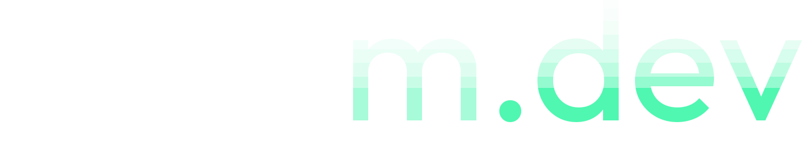

abysm.dev is a free game creation platform for the web that has multiplayer baked into the engine, so you can focus on your game. 

## *huh?*
abysm.dev is similar to platforms like Roblox, in that you can make an online multiplayer game for completely free, and complicated stuff like the networking and server hosting is covered by me.

What makes abysm.dev different is that you don't need to install a game client. Just go over to the game you want to play, and press play. 

You can also make a game with a free account, using Lua to script.

All of the code is completely open source so that way, the community can drive the development instead of just me dictating what features to add. It also helps alleviate the amount of work and time it'll take to create and develop this platform.

## Why?
I made abysm.dev because of another platform, [modd.io](https://www.modd.io/). It used to be what I dream for this to be, a place where you can make a game and have it up in seconds.

I made a game on it back in 2024, but due to server limitations, it became unplayable, as I'm pretty sure there's a server-side memory leak when you try to play it. I still check in on the platform every once in a while though, but the owner of it is your average Twitter crypto/AI hype bro, so it's transformed a lot, with even AI generated games on the front page *<small>(albeit, at the bottom with no players)*</small>, and the first thing you see being a prompt for making AI games, which I detest.

I wanted to make a more community focused alternative to that. This project isn't meant to chase dollar signs, which is what I feel [modd.io](https://www.modd.io/) is becoming. This project is meant to be driven by the community, for the community.

## How can I contribute?
See [CONTRIBUTING.md](https://github.com/abyssaltheking/abysm.dev/blob/main/CONTRIBUTING.md) for more info.

